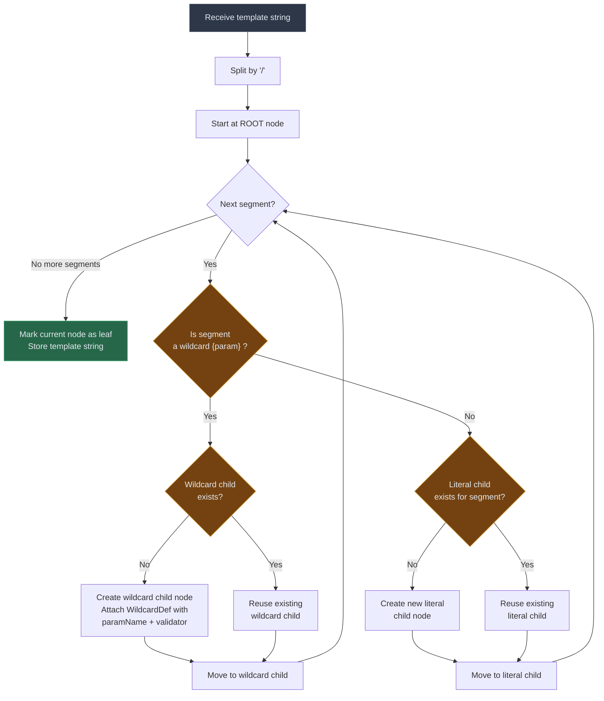
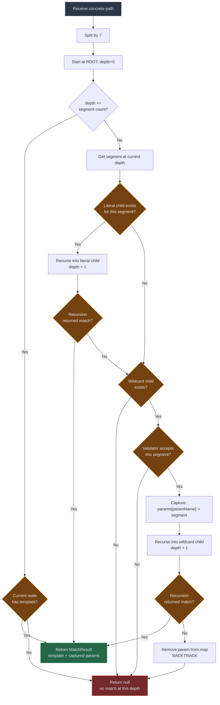

# Path Template Trie — Design Document ("URL Learning")

## 1. Overview

The Path Template Trie is a data structure for resolving concrete HTTP paths (e.g., `/users/jack/posts/123`) into parameterized API templates (e.g., `/users/{name}/posts/{id}`). It serves as the core lookup mechanism in the API discovery pipeline, replacing regex-based pattern matching with a deterministic, segment-level trie traversal.

The trie acts as a fast cache layer. On a cache miss, an LLM is invoked to infer the template, which is then inserted into the trie for future lookups. Over time, the trie converges toward full coverage of observed API traffic, driving LLM call frequency to near-zero.

---

## 2. Problem Statement

Given a stream of raw HTTP paths from API traffic, we need to:

1. **Resolve** each path to a known parameterized template.
2. **Distinguish** between literal segments (`users`, `settings`) and dynamic parameters (`{name}`, `{id}`).
3. **Prefer specificity** — exact literal matches should take priority over wildcard matches.
4. **Handle ambiguity** — when multiple templates could match, the system must deterministically choose the most specific one.
5. **Support runtime growth** — new templates discovered by the LLM must be insertable without downtime.

A regex-based approach (iterating N compiled patterns per incoming path) has O(N × path_length) complexity and becomes a bottleneck as the template cache grows. The trie reduces lookup to O(k) where k is the number of path segments (typically 3–6).

---

## 3. Data Structure

### 3.1 Node Structure

Each node in the trie represents a single depth level in the path hierarchy. A node contains:

| Field            | Type                        | Description                                                  |
|------------------|-----------------------------|--------------------------------------------------------------|
| `literals`       | `Map<String, TrieNode>`     | Literal segment children. Key is the lowercased segment.     |
| `wildcardChild`  | `TrieNode`                  | Single wildcard child node (matches any segment).            |
| `wildcardDef`    | `WildcardDef`               | Param name and optional validator for the wildcard.          |
| `template`       | `String`                    | Non-null only at leaf nodes. The full template string.       |

### 3.2 Wildcard Definition

Each wildcard node carries metadata:

| Field       | Type                    | Description                                          |
|-------------|-------------------------|------------------------------------------------------|
| `paramName` | `String`                | The parameter name (e.g., `"id"`, `"name"`).         |
| `validator` | `Predicate<String>`     | Optional constraint on the segment value.            |

Built-in validators:

| Validator | Matches                          | Example              |
|-----------|----------------------------------|----------------------|
| `ANY`     | Any non-empty segment            | `jack`, `123`, `abc` |
| `NUMERIC` | Digits only                      | `123`, `42`          |
| `UUID`    | Standard UUID format             | `550e8400-e29b-...`  |

### 3.3 Trie Structure Example

Given these registered templates:

```
/users/{name}
/users/{name}/posts/{id}     (id: NUMERIC)
/users/{name}/settings
/api/v1/orders/{id}          (id: UUID)
/api/v1/orders/summary
/health
```

The trie looks like:

```
ROOT
├── "users"
│   └── * {name: ANY}
│       ├── "posts"
│       │   └── * {id: NUMERIC}  → "/users/{name}/posts/{id}"
│       ├── "settings"           → "/users/{name}/settings"
│       └── (leaf)               → "/users/{name}"
├── "api"
│   └── "v1"
│       └── "orders"
│           ├── "summary"        → "/api/v1/orders/summary"
│           └── * {id: UUID}     → "/api/v1/orders/{id}"
└── "health"                     → "/health"
```

---

## 4. Insert Flow

Insertion is triggered when the LLM returns a new template. The template string is parsed segment by segment; literal segments create literal children, `{param}` segments create wildcard children.

### 4.1 Algorithm

```
function insert(template, validators):
    segments = split(template, "/")
    node = root
    for each segment in segments:
        if segment is "{param}":
            paramName = extract(segment)
            validator = validators.get(paramName) or ANY
            if node.wildcardChild is null:
                node.wildcardChild = new TrieNode()
                node.wildcardDef = WildcardDef(paramName, validator)
            node = node.wildcardChild
        else:
            node = node.literals.computeIfAbsent(segment)
    node.template = template
```

### 4.2 Insert Flow Diagram



### 4.3 Insert Example Walkthrough

Inserting `/users/{name}/posts/{id}` with `{id: NUMERIC}`:

| Step | Segment    | Action                              | Current Node         |
|------|------------|-------------------------------------|----------------------|
| 1    | `users`    | Create/find literal child "users"   | ROOT → "users"       |
| 2    | `{name}`   | Create wildcard child {name: ANY}   | "users" → * {name}   |
| 3    | `posts`    | Create/find literal child "posts"   | * {name} → "posts"   |
| 4    | `{id}`     | Create wildcard child {id: NUMERIC} | "posts" → * {id}     |
| done |            | Mark leaf, store template           | * {id} ✓             |

---

## 5. Lookup Flow

Lookup takes a concrete path and traverses the trie depth-first, **always preferring literal matches over wildcard matches** at each level. If a branch leads to a dead end, the algorithm backtracks and tries the wildcard alternative.

### 5.1 Algorithm

```
function lookup(path):
    segments = split(path, "/")
    params = {}
    return doLookup(root, segments, depth=0, params)

function doLookup(node, segments, depth, params):
    if depth == segments.length:
        return node.template != null ? Match(node.template, params) : null

    segment = segments[depth]

    // Priority 1: Try literal match
    literalChild = node.literals.get(segment)
    if literalChild != null:
        result = doLookup(literalChild, segments, depth+1, params)
        if result != null: return result

    // Priority 2: Fall back to wildcard
    if node.wildcardChild != null:
        if node.wildcardDef.validator.test(segment):
            params.put(node.wildcardDef.paramName, segment)
            result = doLookup(node.wildcardChild, segments, depth+1, params)
            if result != null: return result
            params.remove(node.wildcardDef.paramName)  // backtrack

    return null
```

### 5.2 Lookup Flow Diagram



### 5.3 Lookup Example Walkthrough

Path: `/api/v1/orders/summary`

| Depth | Segment    | Literal child? | Wildcard child? | Action                     |
|-------|------------|----------------|-----------------|----------------------------|
| 0     | `api`      | ✅ "api"       | —               | Follow literal             |
| 1     | `v1`       | ✅ "v1"        | —               | Follow literal             |
| 2     | `orders`   | ✅ "orders"    | —               | Follow literal             |
| 3     | `summary`  | ✅ "summary"   | ✅ * {id: UUID} | Literal wins → follow it   |
| done  |            |                |                 | → `/api/v1/orders/summary` |

Path: `/api/v1/orders/550e8400-e29b-41d4-a716-446655440000`

| Depth | Segment           | Literal child? | Wildcard child? | Action                         |
|-------|-------------------|----------------|-----------------|--------------------------------|
| 0     | `api`             | ✅ "api"       | —               | Follow literal                 |
| 1     | `v1`              | ✅ "v1"        | —               | Follow literal                 |
| 2     | `orders`          | ✅ "orders"    | —               | Follow literal                 |
| 3     | `550e8400-e2...`  | ❌             | ✅ * {id: UUID} | No literal → try wildcard      |
|       |                   |                | UUID valid? ✅  | Capture id, follow wildcard    |
| done  |                   |                |                 | → `/api/v1/orders/{id}`        |

Path: `/api/v1/orders/not-a-uuid`

| Depth | Segment        | Literal child? | Wildcard child? | Action                            |
|-------|----------------|----------------|-----------------|-----------------------------------|
| 0–2   | (same as above)| ✅             | —               | Follow literals                   |
| 3     | `not-a-uuid`   | ❌             | ✅ * {id: UUID} | No literal → try wildcard         |
|       |                |                | UUID valid? ❌  | Validator rejects → **NO MATCH**  |

---

## 6. End-to-End System Flow


---

## 7. Concurrency Model

The trie is designed for a **read-heavy workload**: the vast majority of operations are lookups, with occasional inserts when the LLM discovers a new template.

| Operation | Lock Type  | Blocking Behavior                    |
|-----------|------------|--------------------------------------|
| Lookup    | Read lock  | Concurrent with other reads          |
| Insert    | Write lock | Exclusive — blocks reads and writes  |
| Remove    | Write lock | Exclusive — blocks reads and writes  |
| List      | Read lock  | Concurrent with other reads          |

The `ConcurrentHashMap` for literal children provides additional safety for concurrent read access to the literal map itself.

---

## 8. Performance Characteristics

| Metric            | Value                          | Notes                                   |
|-------------------|--------------------------------|-----------------------------------------|
| Lookup time       | O(k)                           | k = number of path segments (3–6 typical) |
| Insert time       | O(k)                           | One node creation per segment            |
| Memory per template | O(k) nodes                   | Shared prefixes are deduplicated         |
| Memory for 10K templates | ~40K nodes            | Assuming avg 4 segments/template         |
| Backtracking worst case | O(2^k)                  | Only with many overlapping wildcards; negligible in practice for REST APIs |

### Comparison with Regex Approach

| Approach            | Lookup Complexity       | Maintenance      |
|---------------------|-------------------------|------------------|
| Iterate N regexes   | O(N × path_length)      | Recompile on add |
| Single combined DFA | O(path_length)          | Recompile on add |
| **Segment trie**    | **O(k), k = segments**  | **O(k) insert**  |

---

## 9. Limitations and Future Considerations

**Multi-segment wildcards** — the current design matches one segment per wildcard. Paths like `/files/{filepath}` where filepath spans multiple segments (e.g., `a/b/c.txt`) are not supported. These would require a greedy wildcard node type that consumes remaining segments. Recommendation: handle these as LLM fallback cases until the pattern is common enough to warrant the added complexity.

**Multiple wildcards at the same level** — each node supports at most one wildcard child. If two templates differ only in wildcard validation at the same position (e.g., `/items/{id:NUMERIC}` and `/items/{slug:ALPHA}`), only one can be stored. This could be extended with a list of typed wildcards tried in priority order.

**Persistence** — the trie is in-memory only. On restart, it must be rebuilt. The `listTemplates()` method enables serialization: dump all templates to a file/database and re-insert on startup.

**Template conflict detection** — inserting two templates that resolve identically (e.g., `/users/{name}` and `/users/{id}`) silently overwrites. A conflict detection mechanism could warn on ambiguous inserts.