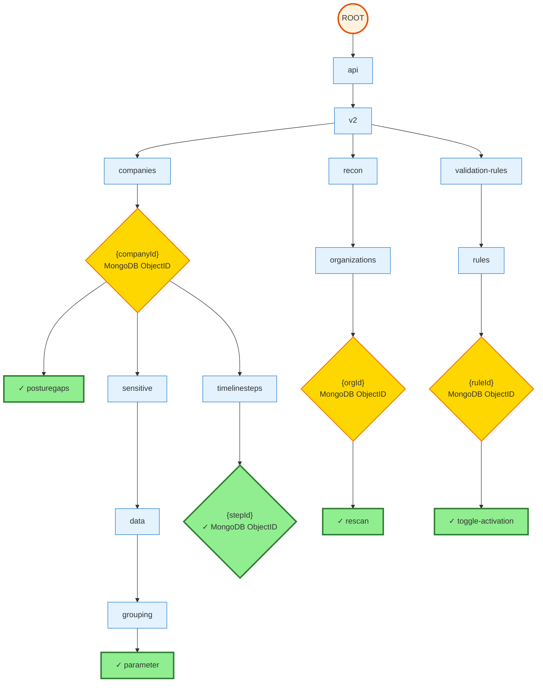
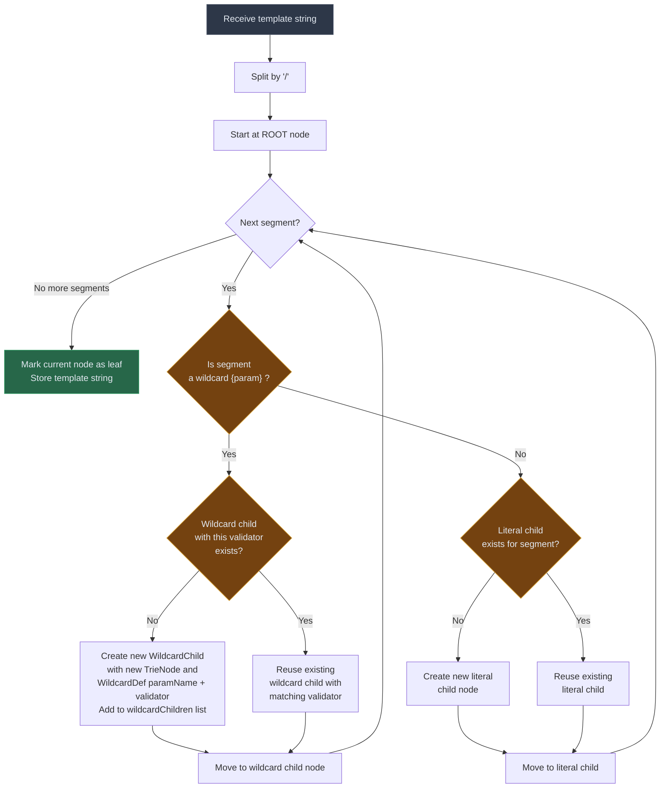
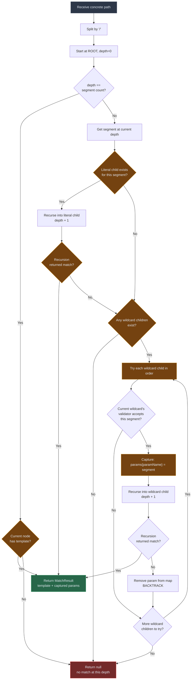

# Path Template Trie — Design Document ("URL Learning")

## TL;DR

**What it does:** Maps concrete API paths (e.g., `/api/v2/companies/645d4369eb31790784df4dc0/posturegaps`) to parameterized templates (e.g., `/api/v2/companies/{companyId}/posturegaps`) in **~1 microsecond** using a prefix tree.

**Why it's fast:** O(k) lookup complexity where k = number of path segments (typically 3-8). No regex scanning, no linear search through thousands of patterns.

### Real-World Example: Production API Trie

**Input:** 5 concrete API requests with actual IDs (what the trie receives):

```
/api/v2/companies/645d4369eb31790784df4dc0/posturegaps
/api/v2/companies/654bc386246a8b65e779ec64/sensitive/data/grouping/parameter
/api/v2/companies/68af3287aa9ad44acdf6372f/timelinesteps/696f4b52803c910ea8a10df8
/api/v2/recon/organizations/68befe54c85efb6b109d1716/rescan
/api/v2/validation-rules/rules/6847c8c41b0000935dc44d38/toggle-activation
```

**Output:** The trie maps each concrete path to its parameterized template:
- `645d4369eb31790784df4dc0` → `{companyId}` (MongoDB ObjectID)
- `696f4b52803c910ea8a10df8` → `{stepId}` (MongoDB ObjectID)
- `68befe54c85efb6b109d1716` → `{orgId}` (MongoDB ObjectID)
- etc.

**Trie Structure:** Here's how these paths are organized internally after templates are learned:



**Legend:**

*Node Shape (matching type):*
- **Rectangle** `[text]`: Literal segment (exact string match required)
- **Diamond** `{text}`: Wildcard segment (parameter capture with validation)
- **Circle** `((text))`: Root node

*Node Color (endpoint status):*
- 🟢 **Green with ✓**: Leaf node (endpoint storing complete template string)
- 🟡 **Yellow**: Wildcard node (intermediate, not an endpoint)
- 🔵 **Blue**: Literal node (intermediate, not an endpoint)
- 🟠 **Orange**: Root node

**Key Insights:**
- **Prefix sharing**: All 5 paths share `/api/v2`, requiring only 2 nodes for common prefix
- **Branch factor**: 3 main branches at depth 3 (`companies`, `recon`, `validation-rules`)
- **Max depth**: 8 segments for longest path (`/api/v2/companies/{id}/sensitive/data/grouping/parameter`)
- **Lookup speed**: ~0.93 µs average (1.07M lookups/second) when cache is warm

**Performance: Cold vs Warm Cache**
| Scenario | Lookup Time | Operations |
|----------|-------------|------------|
| **Cold cache** (empty trie, calls LLM) | ~1+ second | LLM inference + trie insert |
| **Warm cache** (template cached) | **~0.93 µs** | Tree walk only (8 nodes max) |
| **Speedup** | **600,000×** faster | No LLM, no regex, just pointer hops |

---

## 1. Overview

The Path Template Trie is a data structure for resolving concrete HTTP paths (e.g., `/users/jack/posts/123`) into parameterized API templates (e.g., `/users/{name}/posts/{id}`). It serves as the core lookup mechanism in the API discovery pipeline, replacing regex-based pattern matching with a deterministic, segment-level trie traversal.

The trie acts as a fast cache layer. On a cache miss, an LLM is invoked to infer the template, which is then inserted into the trie for future lookups. Over time, the trie converges toward full coverage of observed API traffic, driving LLM call frequency to near-zero.

---

## 2. Problem Statement

Given a stream of raw HTTP paths from API traffic, we need to:

1. **Resolve** each path to a known parameterized template.
2. **Distinguish** between literal segments (`users`, `settings`) and dynamic parameters (`{name}`, `{id}`).
3. **Prefer specificity** — exact literal matches should take priority over wildcard matches.
4. **Handle ambiguity** — when multiple templates could match, the system must deterministically choose the most specific one.
5. **Support runtime growth** — new templates discovered by the LLM must be insertable without downtime.

A regex-based approach (iterating N compiled patterns per incoming path) has O(N × path_length) complexity and becomes a bottleneck as the template cache grows. The trie reduces lookup to O(k) where k is the number of path segments (typically 3–6).

---

## 3. Data Structure

### 3.1 Node Structure

Each node in the trie represents a single depth level in the path hierarchy. A node contains:

| Field               | Type                        | Description                                                  |
|---------------------|-----------------------------|--------------------------------------------------------------|
| `literals`          | `Map<String, TrieNode>`     | Literal segment children. Key is the lowercased segment.     |
| `wildcardChildren`  | `List<WildcardChild>`       | Multiple wildcard children (supports different validators).  |
| `template`          | `String`                    | Non-null only at leaf nodes. The full template string.       |

Each `WildcardChild` encapsulates:
- `node` - The continuation trie node
- `def` - The WildcardDef (parameter name + validator)

This design enables **multiple validators at the same path position**, supporting API versioning and migration scenarios where different ID formats coexist.

### 3.2 Wildcard Definition

Each wildcard node carries metadata:

| Field       | Type                    | Description                                          |
|-------------|-------------------------|------------------------------------------------------|
| `paramName` | `String`                | The parameter name (e.g., `"id"`, `"name"`).         |
| `validator` | `Predicate<String>`     | Optional constraint on the segment value.            |

Built-in validators:

**Pattern-based Validators:**

| Validator | Matches | Example |
|-----------|---------|---------|
| `ANY` | Any non-empty segment | `jack`, `123`, `abc-def` |
| `NUMERIC` | Digits only (e.g., IDs) | `123`, `42`, `999` |
| `UUID` | Standard UUID format | `550e8400-e29b-41d4-a716-446655440000` |
| `MONGODB_ID` | MongoDB ObjectId (24 hex chars) | `64e7a294e854ff2eb3550075` |

**Set-based Validators (Closed Sets):**

| Validator | Type | Count | Examples |
|-----------|------|-------|----------|
| `IATA_AIRPORT` | 3-letter airport codes | 500+ | `JFK`, `LAX`, `LHR`, `CDG` |
| `ICAO_AIRPORT` | 4-letter airport codes | 300+ | `KJFK`, `EGLL`, `LFPG` |
| `ISO_639_1_LANGUAGE` | 2-letter language codes | 184 | `en`, `es`, `fr`, `de`, `zh` |
| `ISO_639_2_LANGUAGE` | 3-letter language codes | 200+ | `eng`, `spa`, `fra`, `deu` |
| `ISO_3166_COUNTRY_ALPHA2` | 2-letter country codes | 249 | `US`, `GB`, `FR`, `DE`, `CN` |
| `ISO_3166_COUNTRY_ALPHA3` | 3-letter country codes | 249 | `USA`, `GBR`, `FRA`, `DEU` |
| `ISO_4217_CURRENCY` | 3-letter currency codes | 210+ | `USD`, `EUR`, `GBP`, `JPY` |
| `HTTP_STATUS_CODE` | HTTP status codes | 60+ | `200`, `404`, `500`, `503` |

Set-based validators use HashSet for O(1) lookup (~15ns) and are case-insensitive. They're optimized for real-world closed sets like airport codes and ISO standards.

### 3.3 Multiple Validators in a Single Path

A single path template can use **different validators for different parameters**, enabling precise validation of complex API patterns.

**Example: Flight Search API**

```java
trie.insert("/flights/{origin}/{destination}/prices/{currency}",
    Map.of(
        "origin", SegmentValidator.IATA_AIRPORT,      // JFK, LAX, LHR
        "destination", SegmentValidator.IATA_AIRPORT,  // Must be valid airport codes
        "currency", SegmentValidator.ISO_4217_CURRENCY // USD, EUR, GBP
    ));
```

Lookup behavior:
- ✅ `/flights/JFK/LAX/prices/USD` → Matches (all valid)
- ✅ `/flights/LHR/CDG/prices/EUR` → Matches (all valid)
- ❌ `/flights/XYZ/LAX/prices/USD` → **No match** (XYZ not a valid IATA code)
- ❌ `/flights/JFK/LAX/prices/ZZZ` → **No match** (ZZZ not a valid currency)

**Example: Internationalized Content API**

```java
trie.insert("/content/{lang}/{country}/news",
    Map.of(
        "lang", SegmentValidator.ISO_639_1_LANGUAGE,        // en, es, fr
        "country", SegmentValidator.ISO_3166_COUNTRY_ALPHA2 // US, GB, FR
    ));
```

Lookup behavior:
- ✅ `/content/en/US/news` → Matches (valid language + country)
- ✅ `/content/fr/FR/news` → Matches (French content for France)
- ❌ `/content/xyz/US/news` → **No match** (xyz not a valid language code)
- ❌ `/content/en/XX/news` → **No match** (XX not a valid country code)

**Example: Mixed ID Types**

```java
// Company endpoint with MongoDB ID
trie.insert("/api/companies/{companyId}/config",
    Map.of("companyId", SegmentValidator.MONGODB_ID));

// Order endpoint with UUID
trie.insert("/api/orders/{orderId}/details",
    Map.of("orderId", SegmentValidator.UUID));

// User endpoint with numeric ID
trie.insert("/api/users/{userId}/profile",
    Map.of("userId", SegmentValidator.NUMERIC));
```

The trie will correctly route each path based on the ID format, preventing cross-contamination of different resource types.

### 3.4 Trie Structure Example

Given these registered templates:

```
/users/{name}
/users/{name}/posts/{id}     (id: NUMERIC)
/users/{name}/settings
/api/v1/orders/{id}          (id: UUID)
/api/v1/orders/summary
/health
```

The trie looks like:

```
ROOT
├── "users"
│   └── * {name: ANY}
│       ├── "posts"
│       │   └── * {id: NUMERIC}  → "/users/{name}/posts/{id}"
│       ├── "settings"           → "/users/{name}/settings"
│       └── (leaf)               → "/users/{name}"
├── "api"
│   └── "v1"
│       └── "orders"
│           ├── "summary"        → "/api/v1/orders/summary"
│           └── * {id: UUID}     → "/api/v1/orders/{id}"
└── "health"                     → "/health"
```

---

## 4. Insert Flow

Insertion is triggered when the LLM returns a new template. The template string is parsed segment by segment; literal segments create literal children, `{param}` segments create wildcard children.

### 4.1 Algorithm

```
function insert(template, validators):
    segments = split(template, "/")
    node = root
    for each segment in segments:
        if segment is "{param}":
            paramName = extract(segment)
            validator = validators.get(paramName) or ANY

            // Check if wildcard with this validator already exists
            existingWildcard = node.findWildcardChild(validator)
            if existingWildcard != null:
                node = existingWildcard.getNode()  // Reuse existing path
            else:
                // Create new wildcard child with this validator
                newNode = new TrieNode()
                wildcardChild = new WildcardChild(newNode, WildcardDef(paramName, validator))
                node.addWildcardChild(wildcardChild)
                node = newNode
        else:
            node = node.literals.computeIfAbsent(segment)
    node.template = template
```

### 4.2 Insert Flow Diagram



### 4.3 Insert Example Walkthrough

Inserting `/users/{name}/posts/{id}` with `{id: NUMERIC}`:

| Step | Segment    | Action                              | Current Node         |
|------|------------|-------------------------------------|----------------------|
| 1    | `users`    | Create/find literal child "users"   | ROOT → "users"       |
| 2    | `{name}`   | Create wildcard child {name: ANY}   | "users" → * {name}   |
| 3    | `posts`    | Create/find literal child "posts"   | * {name} → "posts"   |
| 4    | `{id}`     | Create wildcard child {id: NUMERIC} | "posts" → * {id}     |
| done |            | Mark leaf, store template           | * {id} ✓             |

---

## 5. Lookup Flow

Lookup takes a concrete path and traverses the trie depth-first, **always preferring literal matches over wildcard matches** at each level. If a branch leads to a dead end, the algorithm backtracks and tries the wildcard alternative.

### 5.1 Algorithm

```
function lookup(path):
    segments = split(path, "/")
    params = {}
    return doLookup(root, segments, depth=0, params)

function doLookup(node, segments, depth, params):
    if depth == segments.length:
        return node.template != null ? Match(node.template, params) : null

    segment = segments[depth]

    // Priority 1: Try literal match
    literalChild = node.literals.get(segment)
    if literalChild != null:
        result = doLookup(literalChild, segments, depth+1, params)
        if result != null: return result

    // Priority 2: Try all wildcard children
    for each wildcardChild in node.wildcardChildren:
        wildcardDef = wildcardChild.getDef()
        if wildcardDef.validator.test(segment):
            params.put(wildcardDef.paramName, segment)
            result = doLookup(wildcardChild.getNode(), segments, depth+1, params)
            if result != null: return result
            params.remove(wildcardDef.paramName)  // backtrack

    return null
```

### 5.2 Lookup Flow Diagram



### 5.3 Lookup Example Walkthrough

Path: `/api/v1/orders/summary`

| Depth | Segment    | Literal child? | Wildcard child? | Action                     |
|-------|------------|----------------|-----------------|----------------------------|
| 0     | `api`      | ✅ "api"       | —               | Follow literal             |
| 1     | `v1`       | ✅ "v1"        | —               | Follow literal             |
| 2     | `orders`   | ✅ "orders"    | —               | Follow literal             |
| 3     | `summary`  | ✅ "summary"   | ✅ * {id: UUID} | Literal wins → follow it   |
| done  |            |                |                 | → `/api/v1/orders/summary` |

Path: `/api/v1/orders/550e8400-e29b-41d4-a716-446655440000`

| Depth | Segment           | Literal child? | Wildcard child? | Action                         |
|-------|-------------------|----------------|-----------------|--------------------------------|
| 0     | `api`             | ✅ "api"       | —               | Follow literal                 |
| 1     | `v1`              | ✅ "v1"        | —               | Follow literal                 |
| 2     | `orders`          | ✅ "orders"    | —               | Follow literal                 |
| 3     | `550e8400-e2...`  | ❌             | ✅ * {id: UUID} | No literal → try wildcard      |
|       |                   |                | UUID valid? ✅  | Capture id, follow wildcard    |
| done  |                   |                |                 | → `/api/v1/orders/{id}`        |

Path: `/api/v1/orders/not-a-uuid`

| Depth | Segment        | Literal child? | Wildcard child? | Action                            |
|-------|----------------|----------------|-----------------|-----------------------------------|
| 0–2   | (same as above)| ✅             | —               | Follow literals                   |
| 3     | `not-a-uuid`   | ❌             | ✅ * {id: UUID} | No literal → try wildcard         |
|       |                |                | UUID valid? ❌  | Validator rejects → **NO MATCH**  |

---

## 6. End-to-End System Flow


---

## 7. Concurrency Model

The trie is designed for a **read-heavy workload**: the vast majority of operations are lookups, with occasional inserts when the LLM discovers a new template.

| Operation | Lock Type  | Blocking Behavior                    |
|-----------|------------|--------------------------------------|
| Lookup    | Read lock  | Concurrent with other reads          |
| Insert    | Write lock | Exclusive — blocks reads and writes  |
| Remove    | Write lock | Exclusive — blocks reads and writes  |
| List      | Read lock  | Concurrent with other reads          |

The `ConcurrentHashMap` for literal children provides additional safety for concurrent read access to the literal map itself.

---

## 8. Performance Characteristics

| Metric            | Value                          | Notes                                   |
|-------------------|--------------------------------|-----------------------------------------|
| Lookup time       | O(k)                           | k = number of path segments (3–6 typical) |
| Insert time       | O(k)                           | One node creation per segment            |
| Memory per template | O(k) nodes                   | Shared prefixes are deduplicated         |
| Memory for 10K templates | ~40K nodes            | Assuming avg 4 segments/template         |
| Backtracking worst case | O(2^k)                  | Only with many overlapping wildcards; negligible in practice for REST APIs |

### Comparison with Regex Approach

| Approach            | Lookup Complexity       | Maintenance      |
|---------------------|-------------------------|------------------|
| Iterate N regexes   | O(N × path_length)      | Recompile on add |
| Single combined DFA | O(path_length)          | Recompile on add |
| **Segment trie**    | **O(k), k = segments**  | **O(k) insert**  |

---

## 9. Capabilities and Limitations

### ✅ Current Capabilities

**Multiple validators at the same position** — Each trie node supports multiple wildcard children with different validators. This enables:
- **API versioning**: Different API versions can use different ID formats at the same path position
- **Migration scenarios**: Legacy and new ID formats coexist during transitions
- **Multi-format support**: Same endpoint accepts different ID types simultaneously

Example:
```java
// Both validators at the same position
trie.insert("/api/users/{id}/profile", Map.of("id", NUMERIC));
trie.insert("/api/users/{id}/profile", Map.of("id", UUID));

// Both formats are valid:
lookup("/api/users/123/profile")                           → ✓ matches NUMERIC
lookup("/api/users/550e8400-e29b-41d4-a716-.../profile")   → ✓ matches UUID
```

Performance: Each wildcard validator is tried in order until one matches. Impact is negligible (~0.01 µs per additional validator), maintaining sub-microsecond lookup times.

### ⚠️ Current Limitations

**Multi-segment wildcards** — Each wildcard matches exactly one path segment. Paths like `/files/{filepath}` where `filepath` spans multiple segments (e.g., `a/b/c.txt`) are not supported. Such patterns require a greedy wildcard that consumes remaining segments. Current recommendation: handle these through LLM inference on cache miss.

**In-memory only** — The trie persists only in memory. On application restart, the trie must be rebuilt from stored templates. The `listTemplates()` method enables persistence: serialize all templates to storage and re-insert on startup.

**No conflict detection** — Inserting overlapping templates (e.g., `/users/{name}` and `/users/{id}` both with ANY validator) creates ambiguous paths. The trie accepts both without warning. The first matching validator during lookup determines which template is used.